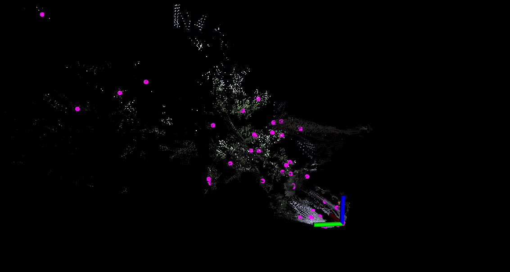
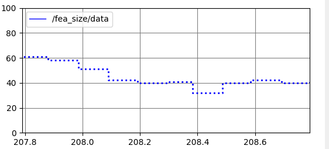
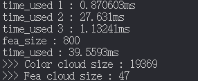

<!--
 * @Author: piluohong 1912694135@qq.com
 * @Date: 2024-02-23 08:53:31
 * @LastEditors: piluohong 1912694135@qq.com
 * @LastEditTime: 2024-02-23 16:54:08
 * @FilePath: /slam/hhh_ws/src/nonlinear_opt_in_slam/README.md
 * @Description: LIvox avia -> image 测试：hku_main_building
-->
## 个人练习
· 投影原理：点云世界坐标系 -> 相机坐标系 -> 像素坐标系；
· 根据点的实际距离实现深度对应；
· 激光雷达与相机视角融合，点云投影2D图像;
· 使用cnn处理图像提取特征点，发布与雷达点云融合的点

效果：

## 效果, image_size [640,512]

 

